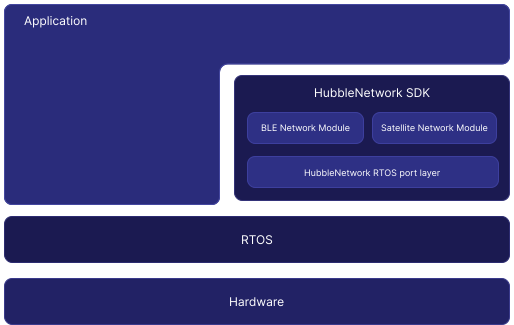

.. _hubble_introduction:

Introduction
############

The Hubble Device SDK is designed with flexibility and scalability in mind.
At its core, the SDK provides two primary functionalities—Satellite
Communication and Bluetooth® Low Energy (BLE) Network Communication—both built 
around a modular architecture. This approach enables straightforward extensions 
or adaptations for various environments, including different real-time operating 
systems (RTOSes).

The diagram below illustrates the role of the Hubble Network SDK within an
embedded application:

   Hubble Network SDK Architecture

.. _hubble_architecture:

Architecture
************

The SDK architecture is built on modularity and extensibility, accommodating
a broad range of implementation requirements. The following sections
summarize its primary components:

Service Modules
===============

The Services Layer contains the core functionality of the SDK, including the
satellite and BLE network modules. Applications interface with the SDK
through these components, leveraging a high-level API that streamlines satellite
and BLE communication.

Satellite Network Module
----------------

Provides APIs to transmit data to the Hubble Network. Because satellite
communication relies on Hubble Network, this module assumes ownership of the
target radio and possibly other devices when in use.

Terrestrial Network Module
------------------

Offers APIs to generate Bluetooth® advertisement packets, enabling connections
to the Hubble's Terrestrial BLE Network. This module uses the standard Bluetooth protocol
and does not assume ownership of any hardware. The application is responsible
for managing the Bluetooth stack.

.. note::
   Hubble Network Inc. is a Bluetooth Member Company.

   The Hubble Device SDK has completed the Bluetooth Qualification Process:

   - Hubble Design Number: Q369913
   - Qualified Product Details: https://qualification.bluetooth.com/ListingDetails/307489

Port Layer
==========

The Port Layer acts as an abstraction between the Service Modules and
RTOS-specific implementations. It defines an API that simplifies porting the
SDK to various RTOS environments beyond those natively supported.
